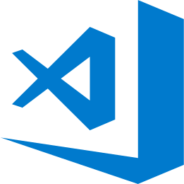
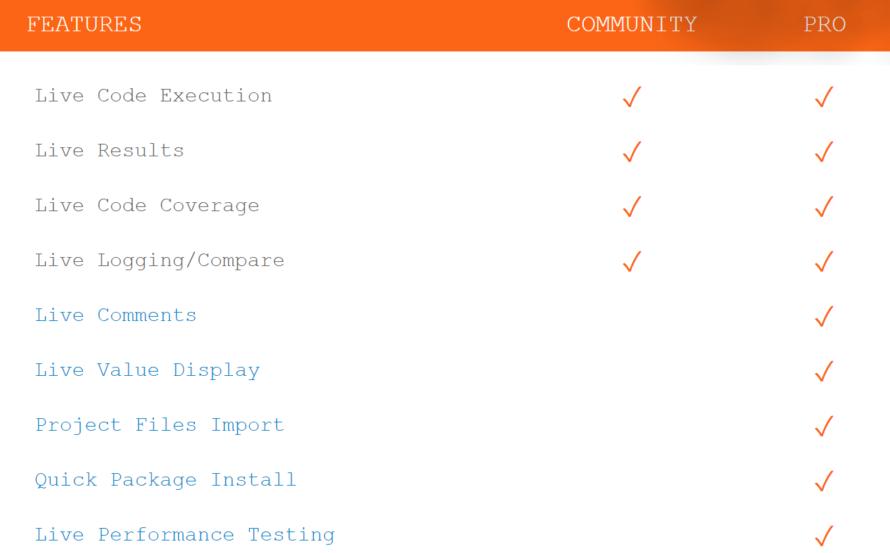

Quokka VSCode Extension
---
---
Khaja M Mohammed
Sep 09, 2018
---

## Welcome... 

Let's learn about <strong>QUOKKA</strong>

### Before that, Who am I?

My name is <strong>Khaja</strong>, I have a strong passion about learning and sharing.  
---
Feel free to connect with me on [LinkedIn](https://www.linkedin.com/in/khaja-moinuddin-mohammed-b9638720/)

## What is Quokka?

> Quokka.js is a rapid prototyping playground for JavaScript and TypeScript. It runs your code immediately as you type and displays various execution results in your code editor.

## What IDE's are supported?

## How to install Quokka on VSCode?

Below instructions are for VSCode
---
1. Go to Extensions 
2. Search for Quokka 
3. Click on Install 
3. Reload the IDE 

## How does Quokka Work?

## Quokka Community vs Pro Freatures

## Resources
> [Quokka JS](https://quokkajs.com/) 
> [Quokka Features](https://quokkajs.com/pro/#performance) 
> [Quokka Plugins](https://quokkajs.com/docs/extensibility.html#plugin-ideas-and-recommendations) 

## Thank You 
---
> Feel free to reach me on [LinkedIn](https://www.linkedin.com/in/khaja-moinuddin-mohammed-b9638720/)